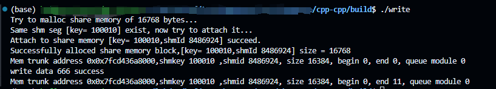
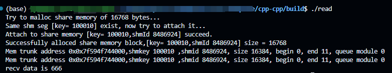
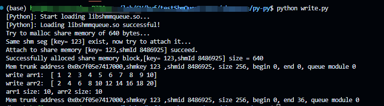
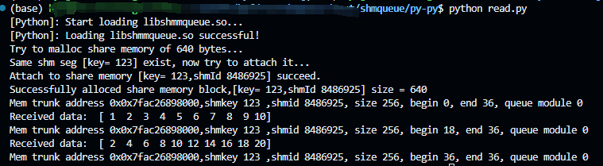
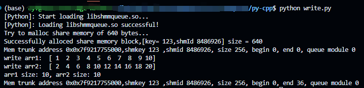
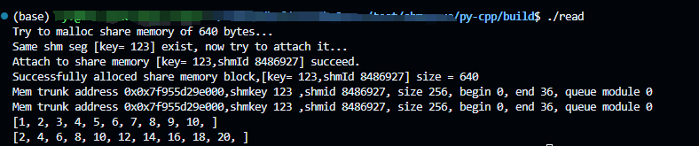

# Python-CPP Communication
This repository aims to facilitate efficient communication between Python and C++ processes. To accelerate data transfer between different processes, the repository implements a shared memory queue for seamless communication between Cpp-Cpp, Py-Py, and Cpp-Py processes.
# Introduction
This project contains:
1. shm_rwlock.cpp、shm_rwlock.h、shmmqueue.cpp、shmmqueue.h: these four files are the main files that implement the core function. This section is a reference to the shmqueue repo: https://github.com/DGuco/shmqueue/.


__By reproducing the repo, I found that it doesn't support process data transfer between multiple processes very well. By reproducing the repository, I have identified that it doesn't effectively support inter-process data transfer in a multi-process environment. To address this limitation, I propose enhancing the functionality by introducing a GetInstance function. This function would allow binding an already created shared memory instance to a queue, enabling the maintenance of a single queue across multiple processes.__

2. PyWapper:The folder's main content is identical to the first point, primarily encapsulated in C language for Python invocation.


3. cpp-cpp、py-cpp、py-py：These folders contain the read and write test code.
 
# Build
1. cpp-cpp
```
$ cd cpp-cpp
$ mkdir build
$ cmake ..
$ make
```
2. py-py
```
$ cd PyWapper
$ mkdir build
$ cd build
$ cmake ..
$ make
$ cp libshmmqueue.so ../
```
3. py-cpp
```
$ cd PyWapper
$ mkdir build
$ cd build
$ cmake ..
$ make
$ cp libshmmqueue.so ../

$ cd py-cpp
$ mkdir build 
$ cd build
$ cmake ..
$ make
```
# Usage
1. cpp-cpp




2. py-py





3. py-cpp




Reference：https://github.com/DGuco/shmqueue
